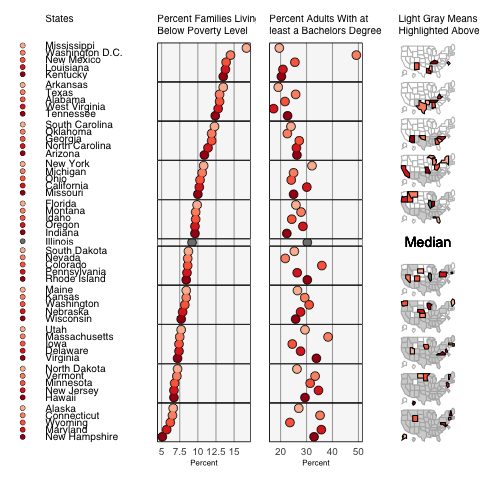

```{r setup, include=FALSE}
knitr::opts_chunk$set(echo = TRUE, cache = TRUE, dpi=300)
```

## What is Exploratory Spatial Data Analysis?

"ESDA is a collection of techniques to describe and visualize spatial distributions, identify atypical locations or spatial outliers, discover patterns of spatial association, clusters or hot-spots, and suggest spatial regimes or other forms of spatial heterogeneity. Central to this conceptualization is the notion of spatial autocorrelation or spatial association, i.e., the phenomenon where locational similarity (observations in spatial proximity) is matched by value similarity (attribute correlation)" Anselin(1998,79-80)

They come from EDA (Exploratory Data Analysis), the EDA are methods or tools that used to identify data properties for purposes of

- Detect patterns in the data
- Formulate hypothesis from the data
- Assess various aspects of models  (e.g., goodness-of-fit)

But since EDA is collection of aspatial techniques. In many instances it is important to be able to link numerical and graphical procedures with a map to answer questions such as "Where are those cases?"

### Introduction to Exploratory Data Analysis (EDA)

EDA emphasizes on the **interaction** between **human cognition** and **computation** in the form of dynamic statistical graphics that allow the user to manipulate ``views'' of the data (via box-plots, scatterplots, etc). 


EDA also uses statistics to identify outliers and detect patterns and other characteristics in the data. 

It is an extension of EDA to detect spatial properties of data. 

ESDA becomes  important because there is a need for additional techniques to

- detect spatial patterns in data
- formulate hypotheses based on the geography of the data 
- assess spatial models


First example of ESDA by Mark Monmonier (1989) Interactive Spatial Data Analysis. Monmonier's analysis consisted in a graphical approach to identify patterns in data With modern graphical interfaces this is often done by ``brushing'' or ``highlighting'' observations

  
  


These geographic brushing tools are now found in some GIS packages. 


In addition to choropleth maps, other displays/views include histograms, box-plots, scatterplots (see GeoDa or the Micromaps package).




``True ESDA pays attention to both spatial and attribute association'' (Anselin, 1998, p.79).


### Tobler's First Law of Geography


"All places are related but nearby places are more related than distant place"

Spatial autocorrelation is the formal property that measures the degree to which near and distant things are related


### Issues to consider

We remember the types of data
- Point data:
Accuracy of location is very important
- Area/lattice dat:
 
Data reported for some regular or irregular areal unit


There are 2 key components of spatial data:


-  Attribute data
- Spatial data

And How you choose to sample, or aggregate, your data is very important
** Affect spatial relationships in your data**


There are problems/challenges with areal data

- Modifiable areal unit problem (MAUP)
- Scale effect spatial data analysis at different scales may produce different results
- Zoning effect regrouping zones at a given scale may produce different results


These issues create the following questions. What are the ?
- Optimal neighborhood/area size.
- Alternative zoning schemes.


Spatial autocorrelation is Scale-Dependent\\


## Spatial Autocorrelation

 Statistical test of match between locational similarity and attribute similarity

Correlation between 

- Positive
- Negative
- Random (Absense) 

Let's remember from statistics class. 


We need to consider how spatially correlated variables can be: 

Which is negative? Which is positive? Which is random? 


Let's remember statistics again:  **Null hypothesis:**
- Spatial randomness
- Values observed at one location do not depend on values observed at neighboring locations
- Observed spatial pattern of values is equally likely as any other spatial pattern 
- The location of values may be altered without affecting the information content of the data


### Positive spatial Autocorrelation
- Clustering:
 like values tend to be in similar locations
- Neighbors are Similar
more alike than they would be under spatial randomness
- Compatible with Diffusion:
 but not necessarily caused by diffusion


**Positive spatial Autocorrelation**

- Positive Spatial Autocorrelation Does Not Imply Diffusion
- diffusion tends to yield positive spatial autocorrelation, but the reverse is not necessary
- spatial correlation may be due to structural factors, without contagion or diffusion
- What is the Cause Behind Clustering 
- True Contagion is the result of a contagious process, social interaction, a dynamic process. 

- Apparent Contagion could be due to spatial heterogeneity, stratification
- It Cannot Be Distinguished In a Pure Cross Section


Positive spatial Autocorrelation


**Negative spatial Autocorrelation**

- Checkerboard Pattern
- ``opposite'' of clustering
- Neighbors are Dissimilar, but more dissimilar than they would be under spatial randomness
- Compatible with Competition, but not necessarily competition


## Who is neighbor to who? 


### Spatial weights matrices

- Neighborhoods can be defined in a number of ways  Contiguity (common boundary)
-  What is a ``shared'' boundary?
-  Distance (distance band, K-nearest neighbors)
-  How many ``neighbors'' to include, what distance do we use?  General weights (social distance, distance decay)
- Other measures: Economic, social, political, trade. 


- Most common is using binary connectivity based on contiguity

$$w_{ij} = 1$$ if regions i and j are contiguous, 

$$w_{ij} = 0$$ otherwise

- May also be defined as a function of the distance between $i$ and $j$

- Distance of the line connecting the centroids of two areas

$$w_{ij} = d_{ij}^{-\beta}$$
$$w_{ij} = exp^{(-\beta d_{ij})}$$


 


 A binary weights matrix looks like:
$$
W=\begin{pmatrix}
0 &1 &0& 0\\
 1&0&1&0\\
  1&1&0&1\\
  0&0&1&0
  \end{pmatrix}
$$

-  Observation 1 has neighbor 2
-  Observation 2 has neighbors 3 and 4
- Observation 3 has neighbors 1 and 2
-  Observation 4 has neighbor 2, 3 and 4
 - A row-standardized matrix it looks like:\\

$$W=\begin{pmatrix} 
0 &1& 0& 0\\
0.5& 0&0.5&0\\
 0.33& 0.33&0& .33\\
0&0&1&0\end{pmatrix}$$


## Tests for the presence of Spatial autocorrelation 

### Global Spatial Autocorrelation Tests 

Measure Degree of Clustering
 
Global Characteristic of Spatial Pattern - NOT Local

- are like values more grouped in space than random
- property of overall pattern = all the observations
- test by means of a global spatial autocorrelation statistic
- One statistic to summarize pattern in whole study area


**Global Spatial Autocorrelation tests**

- Formal Test of Match Between Value Similarity and Locational Similarity 
- Statistic Summarizes Both Aspects
- Significance
how likely is it (p-value) that the computed statistic would take this (extreme) value in a spatially random pattern


### Local Spatial Autocorrelation


Measure presence of Clusters or Hot-spots

Local Characteristic of Spatial Pattern 
- where are like values more grouped in space than random
- property of local pattern = location-specific
- test by means of a local spatial autocorrelation statistic
- local clusters may be compatible with global spatial randomness
- Location-specific statistics


### Tests for the presence of spatial autocorrelation 

- Global
  + Moran's I
  + Geary's C
- Local 
 + Local Moran's (LISA -- Local Indicators of Spatial Autocorrelation) 
 + Getis $G_i^*$
 
- Other tests that are more simple:
  + The Chi-square Test for Spatial Independence
  + The Join Count Statistic

### Moran's Index

- Classic/best measure of spatial autocorrelation
- Depends upon definition of neighboring unit via the spatial weights matrix
- Typically ranges from $-1$ to $1$
- Like regression, it has a few assumptions
 
 + Regional x/y values all come from normal distributions w/same mean and variance for each region
 + Randomly rearrange the data on map and compute I many times, would have a normal distribution
 + Why? Because we use the normal distribution to calculate the p-value


$$I=\frac{n\sum^{n}_{i=1}\sum^{n}_{j=1}w_{ij}(y_i-\bar{y})(y_j-\bar{y})}{(\sum^{n}_{i=1}(y_i-\bar{y})^2)(\sum\sum_{i\neq j}w_{ij})}$$
$n= $ number of regions. 

$W_{ij}=$ Measure of Spatial proximity between region $i$ and $j$


Inference

- Normal:  assume uncorrelated normal distribution
- Z-Value: compute 
$E(I)$ and $Var(I)$ 
$$z = (I - E(I)) / SD(I)$$ 
Regular Standarization. 


- For Significant Statistics Only
- Use z-value
- The result  Index depends on W

- Positive S.A.:
$zI > 0$ for $p < 0.05$ 
- no distinction between clustering of high or low values
- Negative S.A.: 
$zI < 0$ for $p < 0.05$ 


- Variance Instability of Rates 
+ non-constant variance violates assumption of stationarity
+ may lead to spurious indication of spatial autocorrelation

- Empirical Bayes Adjustment (Assuncao-Reis)
+ standardize each rate 
+ use standardized rate


### Geary Coefficient

- Geary's C typically ranges from $0$ to $3$  
- It Cannot be **Negative**
- A Spatially uncorrelated process has an expected $C = 1$
- Values less than $1$ indicate positive spatial autocorrelation
- Values greater than $1$ indicate negative autocorrelation


Relationship of Moran's I and Geary's C


-  C approaches 0 and I approaches 1 when similar values are clustered
- C approaches 3 and I approaches -1 when dissimilar values tend to cluster
- High values of C measures correspond to low values of I
- So the two measures are inversely related


### Moran's Scatterplot

- Moran's I as a Regression Slope
  + in matrix notation: 
$$I = \dfrac{z'Wz} {z'z}$$

  + The Moran's I is the **slope** in regression
 $$Wz = a + I\times z$$ 

- Moran Scatter Plot

- linear association between $Wz$ on the y-axis and $z$ on the x-axis
- each point is pair $(z_i,Wz_i)$, slope is Moran's I


Link with Local Spatial Autocorrelation

- Four Categories of SA
- Positive Spatial Autocorrelation
high-high and low-low: spatial clusters
- Negative Spatial Autocorrelation
high-low and low-high: spatial outliers
- Only Suggestive
no suggestion of significance
relative to mean.

### Local Spatial Autocorrelation -LISA- Local Moran's I

- Anselin (1995)

- Local Spatial Statistic

indicate significant spatial autocorrelation for each location
- Local-Global Relation

sum of LISA proportional to a corresponding global indicator of spatial autocorrelation


- Used to determine if local autocorrelation exists around each region Index
 - Returns an Index value for each region
-  Often used after global Moran's Index to see if:
-  The study area is homogeneous (local statistics similar across regions)
-  There are local outliers that contribute to a significant global statistic

$$I_i=\dfrac{n(y_i-\bar{y})}{\sum_{j}(y_i-\bar{y})^2}\sum_j w_{ij}(y_i-\bar{y})$$


<!-- :::::: {.columns} -->
<!-- ::: {.column width="48%" data-latex="{0.48\textwidth}"} -->
<!-- Here is some example **dplyr** code. -->


```{r package install,echo=T}
r <- getOption("repos")
r["CRAN"] <- "http://cran.cnr.berkeley.edu/"
options(repos = r)
install.packages(c('sp','spdep','maptools'))
```


```{r package loading,echo=T}
library(spdep)
library(maptools)
```


```{r load data,echo=T}
shape <- readShapePoly("Statesmod.shp",IDvar="NAME" )
summary(shape)
```


```{r Create Wmatrix1,echo=T}
nb2=poly2nb(shape, queen=TRUE) 
nb2 
plot(shape, border="grey60") 
plot(nb2, coordinates(shape), add=TRUE, lwd=2) 
```


```{r Create Wmatrix2,echo=T}
b2=poly2nb(shape, queen=F) 
plot(shape, border="grey60") 
plot(nb2, coordinates(shape), add=TRUE, lwd=2) 
   
```


```{r Create Wmatrix3,echo=T}
coords <- coordinates(shape)
states.knn <- knearneigh(coords, k=4)
 
plot(shape, border="grey60") 
plot(knn2nb(states.knn), coordinates(shape), add=TRUE, pcv=".", lwd=2) 
```


```{r Morantest,echo=T}
nb2_W=nb2listw(nb2, style="W", zero.policy=TRUE) 
moran.test(shape$Murder, listw=nb2_W,alternative="two.sided")
moran=moran.test(shape$Murder, listw=nb2_W)
moran

set.seed(1234)
bperm=moran.mc(shape$Murder, listw=nb2_W, nsim=999)
bperm

gearyR=geary.test(shape$Murder, listw=nb2_W)
gearyR

moran.plot(shape$Murder, listw=nb2_W,label=as.character(shape$STUSPS),xlab="Murder Rate", ylab="Spatially Lagged Murder Rate")
```


```{r scatter Morantest,echo=T}
moran.plot2 <- function(x,wfile) 
{ 
xname <- deparse(substitute(x)) # get name of variable 
zx <- (x - mean(x))/sd(x) 
wzx <- lag.listw(wfile,zx, zero.policy=TRUE) 
morlm <- lm(wzx ~ zx) 
aa <- morlm$coefficients[1] 
mori <- morlm$coefficients[2] 
par(pty="s") 
plot(zx,wzx,xlab=xname,ylab=paste("Spatial Lag of ",xname)) 
abline(aa,mori,col=2) 
abline(h=0,lty=2,col=4) 
abline(v=0,lty=2,col=4) 
title(paste("Moran Scatterplot I= ",format(round(mori,4)))) 
} 

moran.plot2(shape$Murder, nb2_W)
```


```{r scatter Morantest2,echo=T}
moran.plot3 <- function(x,y,wfile) 
{ 
xname <- deparse(substitute(x)) # get name of variable 
yname =deparse(substitute(y))
zx <- (x - mean(x))/sd(x) 
zy =(y - mean(y))/sd(y)
wzy <- lag.listw(wfile,zy, zero.policy=TRUE) 
morlm <- lm(wzy ~ zx) 
aa <- morlm$coefficients[1] 
mori <- morlm$coefficients[2] 
par(pty="s") 
plot(zx,wzy,xlab=xname,ylab=paste("Spatial Lag of ",yname)) 
abline(aa,mori,col=2) 
abline(h=0,lty=2,col=4) 
abline(v=0,lty=2,col=4) 
title(paste("Moran Scatterplot I= ",format(round(mori,4)))) 
} 

moran.plot3(shape$Murder,shape$Robbery, nb2_W)
```


```{r LISA Morantest1,echo=T}
LISA.plot <- function(var,listw,signif,mapa) {
  mI.loc <- localmoran(var,listw, zero.policy=T)
  c.var <- var - mean(var)
  c.mI <- mI.loc[,1] - mean(mI.loc[,1])
  quadrant <- vector(mode="numeric",length=nrow(mI.loc))
wzx <- lag.listw(listw,var, zero.policy=TRUE) 
  c.mI1 <- wzx - mean(wzx)
  quadrant[c.var>0 & c.mI1>0] <- 4
  quadrant[c.var<0 & c.mI1<0] <- 1
  quadrant[c.var<0 & c.mI1>0] <- 2
  quadrant[c.var>0 & c.mI1<0] <- 3
  quadrant[mI.loc[,5]>signif] <- 0
  brks <- c(0,1,2,3,4)
  colors <- c("white","blue",rgb(0,0,1,alpha=0.4),rgb(1,0,0,alpha=0.4),"red")
  plot(mapa,border="gray90",col=colors[findInterval(quadrant,brks,all.inside=FALSE)])
  box()
   legend("bottomright",legend=c("not significant","low-low","low-high","high-low","high-high"), fill=colors,bty="n", cex=0.7,y.intersp=1,x.intersp=1)
   title("LISA Mapa de Clusters")
  }


LISA.plot(shape$Murder, nb2_W,0.1, shape) 

```


### Example with the County shapefile and education dataset. 

```{r Examplecounty,echo=T}
shapec <- readShapePoly("countiesmod.shp",IDvar="GEOID" )
summary(shapec)


nb2c=poly2nb(shapec, queen=TRUE) 
nb2c 
plot(shapec, border="grey60") 
plot(nb2c, coordinates(shapec), add=TRUE, pcv=".", lwd=2) 
 nb2_Wc=nb2listw(nb2c, style="W", zero.policy=TRUE)

moran.test(shapec$Bachelor, nb2_Wc)
 
geary.test(shapec$Bachelor, nb2_Wc)

moran.plot2(shapec$Bachelor, nb2_Wc)

LISA.plot(shapec$Bachelor, nb2_Wc,0.05, shapec) 
```


